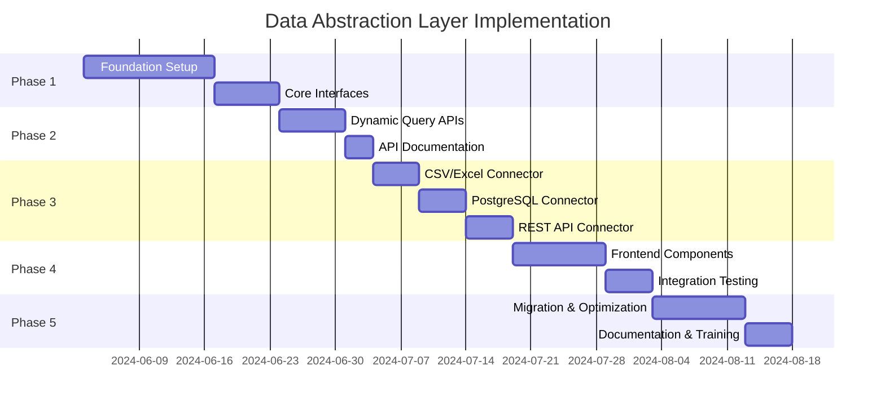

# 🔄 Data Abstraction Layer Implementation Plan

## Executive Summary
Transform the Brand Performance Dashboard from a single-source system to a multi-source data platform while maintaining backward compatibility with all 21 existing API endpoints.

---

## 📋 Table of Contents
1. [Current State Analysis](#current-state-analysis)
2. [Target Architecture](#target-architecture)
3. [Implementation Phases](#implementation-phases)
4. [Technical Specifications](#technical-specifications)
5. [Risk Assessment](#risk-assessment)
6. [Success Metrics](#success-metrics)

---

## Current State Analysis

### Existing Architecture
```
Frontend (React) 
    ↓
21 API Endpoints
    ↓
Memory/Database Storage (Single Source)
    ↓
Hardcoded Philippine Brand Data
```

### Limitations
- **Single Data Source**: Only works with pre-loaded transaction data
- **Fixed Schema**: Hardcoded to brands, transactions, consumers
- **No Extensibility**: Users cannot add their own data
- **Static Queries**: All queries are pre-defined in code

### Strengths to Preserve
- ✅ Working dashboard with real-time updates
- ✅ Well-structured API endpoints
- ✅ Good performance with current data size
- ✅ Clean separation of concerns

---

## Target Architecture

### High-Level Design
```
Frontend (React)
    ↓
Query Builder UI ←→ 21 Existing APIs + 5 New Dynamic APIs
                            ↓
                    Data Abstraction Layer
                    ↙     ↓     ↓     ↘
            Azure SQL  PostgreSQL  REST API  CSV/Excel
```

### Core Components

#### 1. Data Source Manager
- Central registry for all data connections
- Connection pooling and lifecycle management
- Credential management (encrypted)
- Health monitoring

#### 2. Query Engine
- SQL parser and validator
- Query optimizer
- Cross-datasource JOIN capability
- Result caching

#### 3. Schema Discovery
- Automatic schema detection
- Data type mapping
- Relationship inference
- Metadata caching

#### 4. Security Layer
- Query sanitization
- Row-level security
- API key management
- Audit logging

---

## Implementation Phases

### Phase 1: Foundation (Week 1-2)
**Goal**: Build core abstraction without breaking existing functionality

#### Tasks:
1. **Create Base Infrastructure**
   ```typescript
   // File structure
   /server/
     /datasources/
       /core/
         - DataSourceManager.ts
         - BaseConnector.ts
         - QueryEngine.ts
         - SchemaDiscovery.ts
       /connectors/
         - MemoryConnector.ts      // For existing data
         - AzureSQLConnector.ts
         - PostgreSQLConnector.ts
         - RestAPIConnector.ts
         - CSVConnector.ts
       /security/
         - QueryValidator.ts
         - CredentialManager.ts
   ```

2. **Implement Core Interfaces**
   ```typescript
   interface IDataConnector {
     connect(): Promise<void>;
     disconnect(): Promise<void>;
     query(request: QueryRequest): Promise<QueryResult>;
     getSchema(): Promise<DatabaseSchema>;
     testConnection(): Promise<boolean>;
   }

   interface QueryRequest {
     sql?: string;              // Raw SQL
     table?: string;            // Table-based query
     select?: string[];         // Columns
     where?: WhereClause[];     // Conditions
     joins?: JoinClause[];      // Relationships
     groupBy?: string[];        // Aggregations
     orderBy?: OrderClause[];   // Sorting
     limit?: number;            // Pagination
     offset?: number;
   }
   ```

3. **Wrap Existing Storage**
   - Create MemoryConnector that wraps current storage.ts
   - Register as default data source
   - Ensure zero impact on existing endpoints

**Deliverables**:
- ✓ DataSourceManager class
- ✓ BaseConnector abstract class
- ✓ MemoryConnector implementation
- ✓ All existing endpoints still working

### Phase 2: Dynamic Query APIs (Week 3)
**Goal**: Add new endpoints for dynamic data access

#### New Endpoints:
```typescript
// 1. Data Source Management
POST   /api/datasources                    // Add new connection
GET    /api/datasources                    // List connections
GET    /api/datasources/:id                // Get connection details
PUT    /api/datasources/:id                // Update connection
DELETE /api/datasources/:id                // Remove connection
POST   /api/datasources/:id/test           // Test connection

// 2. Schema Discovery
GET    /api/datasources/:id/schema         // Full schema
GET    /api/datasources/:id/tables         // List tables
GET    /api/datasources/:id/tables/:table  // Table details

// 3. Query Execution
POST   /api/datasources/:id/query          // Execute query
POST   /api/datasources/:id/query/validate // Validate query
GET    /api/datasources/:id/query/history  // Query history

// 4. Query Builder
POST   /api/query-builder/parse            // Parse visual query
POST   /api/query-builder/suggest          // Auto-complete
GET    /api/query-builder/functions        // Available functions
```

#### Implementation Details:
```typescript
// Example: Dynamic Query Endpoint
export async function executeDynamicQuery(req: Request, res: Response) {
  const { id } = req.params;
  const { query, parameters, options } = req.body;
  
  try {
    // 1. Validate query
    const validation = await QueryValidator.validate(query, parameters);
    if (!validation.isValid) {
      return res.status(400).json({ 
        error: 'Invalid query', 
        details: validation.errors 
      });
    }
    
    // 2. Check permissions
    const hasAccess = await checkDataSourceAccess(req.user, id);
    if (!hasAccess) {
      return res.status(403).json({ error: 'Access denied' });
    }
    
    // 3. Execute query
    const connector = await DataSourceManager.getConnector(id);
    const result = await connector.query({
      sql: query,
      parameters,
      maxRows: options?.limit || 1000,
      timeout: options?.timeout || 30000
    });
    
    // 4. Transform and return
    res.json({
      success: true,
      data: result.rows,
      metadata: {
        rowCount: result.rowCount,
        executionTime: result.executionTime,
        affectedRows: result.affectedRows,
        schema: result.schema
      }
    });
    
  } catch (error) {
    logger.error('Query execution failed', { error, dataSourceId: id });
    res.status(500).json({ 
      error: 'Query execution failed', 
      message: error.message 
    });
  }
}
```

**Deliverables**:
- ✓ 15 new API endpoints implemented
- ✓ Query validation and sanitization
- ✓ Error handling and logging
- ✓ API documentation updated

### Phase 3: Connector Implementation (Week 4)
**Goal**: Build connectors for common data sources

#### Priority Order:
1. **CSV/Excel Connector** (Quick win for users)
   ```typescript
   class CSVConnector extends BaseConnector {
     private data: any[] = [];
     private schema: TableSchema;
     
     async connect() {
       const fileContent = await fs.readFile(this.config.filePath);
       this.data = await csv.parse(fileContent, {
         header: true,
         dynamicTyping: true
       });
       this.schema = this.inferSchema(this.data);
     }
     
     async query(request: QueryRequest): Promise<QueryResult> {
       // Use alasql for SQL on JavaScript objects
       const result = alasql(request.sql, [this.data]);
       return this.formatResult(result);
     }
   }
   ```

2. **PostgreSQL Connector**
   ```typescript
   class PostgreSQLConnector extends BaseConnector {
     private pool: Pool;
     
     async connect() {
       this.pool = new Pool({
         host: this.config.host,
         port: this.config.port,
         database: this.config.database,
         user: this.config.user,
         password: await this.decryptPassword(this.config.password),
         ssl: this.config.ssl
       });
     }
     
     async query(request: QueryRequest): Promise<QueryResult> {
       const client = await this.pool.connect();
       try {
         const result = await client.query(request.sql, request.parameters);
         return this.formatResult(result);
       } finally {
         client.release();
       }
     }
   }
   ```

3. **REST API Connector**
   ```typescript
   class RestAPIConnector extends BaseConnector {
     async query(request: QueryRequest): Promise<QueryResult> {
       // Map SQL-like queries to REST endpoints
       const endpoint = this.mapQueryToEndpoint(request);
       const response = await axios({
         method: endpoint.method,
         url: `${this.config.baseUrl}${endpoint.path}`,
         headers: this.getAuthHeaders(),
         params: endpoint.params
       });
       
       return this.formatResponse(response.data);
     }
   }
   ```

**Deliverables**:
- ✓ 3-4 working connectors
- ✓ Connection pooling
- ✓ Error recovery
- ✓ Performance optimization

### Phase 4: Frontend Integration (Week 5)
**Goal**: Add UI for data source management and query building

#### Components to Build:
1. **Data Source Manager**
   ```typescript
   const DataSourceManager: React.FC = () => {
     const [sources, setSources] = useState<DataSource[]>([]);
     const [showAddDialog, setShowAddDialog] = useState(false);
     
     return (
       <div className="data-source-manager">
         <DataSourceList 
           sources={sources}
           onSelect={(source) => setActiveSource(source)}
           onEdit={(source) => openEditDialog(source)}
           onDelete={(source) => confirmDelete(source)}
         />
         
         <AddDataSourceDialog
           open={showAddDialog}
           onClose={() => setShowAddDialog(false)}
           onAdd={(config) => addDataSource(config)}
         />
       </div>
     );
   };
   ```

2. **Visual Query Builder**
   ```typescript
   const QueryBuilder: React.FC = () => {
     const [tables, setTables] = useState<Table[]>([]);
     const [selectedColumns, setSelectedColumns] = useState<Column[]>([]);
     const [conditions, setConditions] = useState<Condition[]>([]);
     
     return (
       <div className="query-builder">
         <TableSelector 
           tables={tables}
           onSelect={(table) => addTable(table)}
         />
         
         <ColumnSelector
           columns={getAvailableColumns()}
           selected={selectedColumns}
           onChange={setSelectedColumns}
         />
         
         <ConditionBuilder
           conditions={conditions}
           onChange={setConditions}
         />
         
         <QueryPreview
           sql={buildSQL(selectedColumns, conditions)}
         />
         
         <ExecuteButton
           onClick={() => executeQuery()}
         />
       </div>
     );
   };
   ```

3. **Data Source Selector** (Enhancement to existing dashboard)
   ```typescript
   // Add to existing dashboard header
   <DashboardHeader>
     <DataSourceSelector
       value={activeDataSource}
       onChange={setActiveDataSource}
       options={availableDataSources}
     />
     {/* Existing controls */}
   </DashboardHeader>
   ```

**Deliverables**:
- ✓ Data source management UI
- ✓ Visual query builder
- ✓ Integration with existing dashboard
- ✓ Real-time schema exploration

### Phase 5: Migration & Optimization (Week 6)
**Goal**: Migrate existing endpoints to use abstraction layer

#### Migration Strategy:
1. **Update Existing Endpoints** (One at a time)
   ```typescript
   // Before
   app.get("/api/dashboard/brands", async (req, res) => {
     const brands = await storage.getBrandData();
     res.json(brands);
   });
   
   // After
   app.get("/api/dashboard/brands", async (req, res) => {
     const { dataSourceId = 'default' } = req.query;
     
     const connector = await DataSourceManager.getConnector(dataSourceId);
     const brands = await connector.query({
       table: 'brands',
       orderBy: [{ column: 'value', direction: 'DESC' }]
     });
     
     res.json(brands);
   });
   ```

2. **Add Caching Layer**
   ```typescript
   class QueryCache {
     private cache = new LRUCache<string, CachedResult>({
       max: 1000,
       ttl: 5 * 60 * 1000 // 5 minutes
     });
     
     async get(key: string): Promise<QueryResult | null> {
       const cached = this.cache.get(key);
       if (cached && !this.isExpired(cached)) {
         return cached.result;
       }
       return null;
     }
   }
   ```

3. **Performance Monitoring**
   ```typescript
   class QueryMonitor {
     async trackQuery(
       dataSourceId: string, 
       query: string, 
       executionTime: number
     ) {
       await this.storage.saveMetrics({
         dataSourceId,
         query,
         executionTime,
         timestamp: new Date(),
         userId: getCurrentUser()
       });
     }
   }
   ```

**Deliverables**:
- ✓ All endpoints support multiple data sources
- ✓ Query caching implemented
- ✓ Performance monitoring
- ✓ Migration documentation

---

## Technical Specifications

### API Contract Changes
```typescript
// Backward compatible enhancement
interface EnhancedRequest extends Request {
  query: {
    // Existing parameters
    ...existingParams,
    
    // New optional parameter
    dataSourceId?: string;  // Defaults to 'default'
  }
}
```

### Security Considerations
1. **Query Validation**
   - SQL injection prevention
   - Query complexity limits
   - Timeout enforcement

2. **Access Control**
   - Per-datasource permissions
   - Row-level security
   - API key management

3. **Audit Trail**
   - Query logging
   - Access logging
   - Change tracking

### Performance Requirements
- Query response time: < 2 seconds for 95% of queries
- Concurrent connections: Support 10+ data sources
- Cache hit rate: > 60% for repeated queries
- Memory usage: < 2GB per connector

---

## Risk Assessment

### Technical Risks
| Risk | Impact | Likelihood | Mitigation |
|------|--------|------------|------------|
| Breaking existing APIs | High | Low | Extensive testing, gradual rollout |
| Performance degradation | Medium | Medium | Caching, query optimization |
| Security vulnerabilities | High | Low | Security audit, penetration testing |
| Data source compatibility | Medium | Medium | Start with common sources |

### Business Risks
| Risk | Impact | Likelihood | Mitigation |
|------|--------|------------|------------|
| User adoption | Medium | Low | Good documentation, tutorials |
| Complexity increase | Medium | Medium | Intuitive UI, sensible defaults |
| Support burden | Low | Medium | Self-service tools, good errors |

---

## Success Metrics

### Phase 1-2 (Foundation)
- ✓ Zero downtime during implementation
- ✓ All existing endpoints still working
- ✓ < 10ms overhead on existing queries

### Phase 3-4 (Features)
- ✓ 3+ data source types supported
- ✓ Visual query builder functional
- ✓ < 2 second query execution time

### Phase 5 (Adoption)
- ✓ 50% of queries using new system within 1 month
- ✓ 90% user satisfaction score
- ✓ 5+ custom data sources added by users

### Long-term (3 months)
- ✓ 10+ connector types available
- ✓ 100+ active data sources
- ✓ 1000+ queries per day

---

## Implementation Timeline



---

## Next Steps

1. **Review and Approval**
   - Technical review by development team
   - Business stakeholder sign-off
   - Resource allocation

2. **Preparation**
   - Set up development environment
   - Create feature branch
   - Set up testing framework

3. **Kickoff**
   - Team briefing
   - Task assignment
   - Daily standups

## Conclusion

This plan provides a clear path to transform the Brand Performance Dashboard into a flexible, multi-source data platform while maintaining all existing functionality. The phased approach minimizes risk and allows for continuous delivery of value.

**Estimated Total Timeline**: 6 weeks
**Estimated Effort**: 2-3 developers
**Risk Level**: Low to Medium
**Business Impact**: High